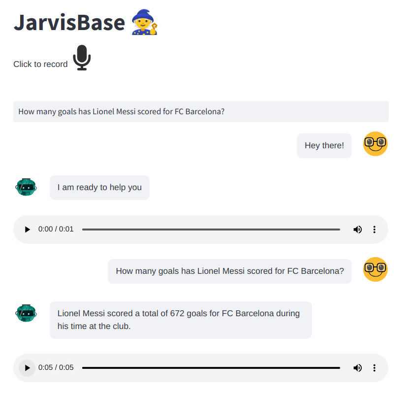

# Voice Assistant for Knowledge Base

## Description

This repository contains a Voice Assistant application designed to interact with a knowledge base using voice commands. The project integrates LangChain for managing conversational interactions and DeepLake for knowledge storage and retrieval. The knowledge base includes data retrieved from Wikipedia pages about notable football players.



## Features

- Voice-based interaction with a knowledge base
- Natural language processing for understanding and generating responses
- Contextual and relevant responses based on user queries

## Installation

1. Clone the Repository
   ```{bash}
   git clone https://github.com/javimp2003uma/VoiceAssistantForKnowledgeBase
   cd VoiceAssistantForKnowledgeBase
   ```

2. Set Up a Virtual Environment
   ```{bash}
   python -m venv venv
   source venv/bin/activate  # On Windows use `venv\Scripts\activate`
   ```

3. Install Dependencies

   ```{bash}
   pip install -r requirements.txt
   ```

4. Configure the Application

   - Set up LangChain and DeepLake according to their respective documentation.
   - Create and edit configuration files as necessary.

5. Prepare the API keys.
   Write an APIkeys.txt file with the following format:
   ```{bash}
   openai: sk-...
   activeloop: ey...
   elevenlabs: ...
   ```
   where in each line the API key of the corresponding platform should be written.

6. Run the Application
   ```{bash}
   python3 gatheringData.py
   streamlit run voiceAssistant.py
   ```

## Configuration

- LangChain: Edit `config/langchain_config.yml` to configure LangChain settings.
- DeepLake: Follow DeepLake Documentation to set up and configure DeepLake.

## Usage

1. Start the application.
2. Use voice commands to interact with the knowledge base.
3. The assistant will process queries and provide relevant responses based on the knowledge base content.

## Contact

For any questions or feedback, please contact on my LinkedIn account: https://www.linkedin.com/in/javier-montes-p%C3%A9rez-a9765a279/
